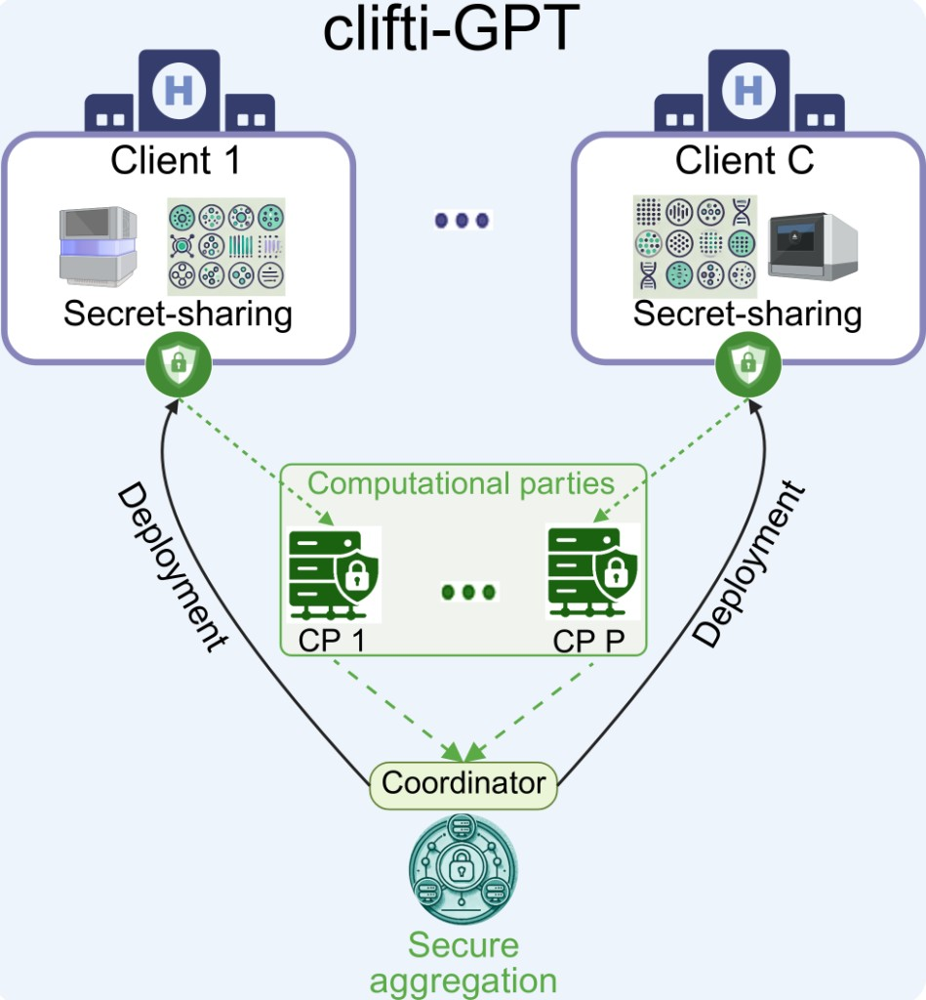

# Clifti-GPT

**Privacy-preserving federated fine-tuning and transferable inference of foundation models on clinical single-cell data**

Clifti-GPT is a secure, privacy-preserving federated learning framework built specifically for fine-tuning and deploying single-cell foundation models (FMs) across decentralized, heterogeneous clinical cohorts.

By leveraging Secure Multi-Party Computation (SMPC) and additive secret sharing, Clifti-GPT allows multiple medical institutions to collaboratively leverage powerful transformer models without ever centralizing patient-level raw count matrices, moving data embeddings, or exposing institutional models and local statistics.

  

<em>Overview of the Clifti-GPT workflow: secret-sharing at client sites, secure computation on shares, and coordinator-driven secure aggregation and deployment.</em>

## 🛠️ Framework architecture and key technical modules

Clifti-GPT adapts the scGPT foundation model architecture to a distributed, cryptographically secure environment. The core framework consists of two main pillars designed to protect data and process privacy under strict data protection policies (such as GDPR):

### 1. Secure federated fine-tuning and inference

- **Additive secret sharing:** Model weights, gradient updates, and clinical statistics are split into encrypted cryptographic shares distributed across independent SMPC parties.
- **Transferable zero-shot inference:** Reference mapping and zero-shot cell-type classification are executed across distributed clinical repositories by securely aggregating local statistics rather than centralizing cell embeddings.

### 2. Cryptographically protected preprocessing (SMPC binning)

To handle scGPT's tokenization pipeline—which converts continuous gene expression values into discrete tokens—Clifti-GPT features a custom federated secure histogram binning protocol:

- **Secure max-expression aggregation:** Calculates global maximum expression constraints (`max_expr`) inside secret shares to initialize a public reference grid *g*.
- **Encrypted quantile-cut matching:** Computes cumulative histogram sums and evaluates target quantile targets entirely within the secret-shared domain using secure comparison masking vectors (`geMask`).
- **Final blind reveal:** Only the final global bin boundaries (`B_global`) are revealed to the clients at the end of the runtime loop, guaranteeing that pooled cross-client cell distributions and sample sizes remain entirely confidential.

## Repository layout

| Path | Description |
|------|-------------|
| [`cliftiGPT/`](cliftiGPT/) | Core library: federated and centralized annotators, embedders, preprocessors, and SMPC aggregation |
| [`tasks/`](tasks/) | Python entry points for annotation and embedding experiments |
| [`experiments/`](experiments/) | Shell scripts to reproduce paper experiments (`run-all.sh` and related drivers) |
| [`analysis/`](analysis/) | Post-training analysis, figures, communication-cost and binning benchmarks |
| [`data/`](data/) | Benchmark data layout and download instructions ([`data/README.md`](data/README.md)) |
| [`models/`](models/) | Pretrained scGPT checkpoints and per-dataset init weights (not shipped in git) |

## Data

Clifti-GPT experiments require benchmark AnnData, per-dataset init weights, and the scGPT foundation checkpoint. None of these are shipped in git.

### Benchmark AnnData

Download the benchmark archives from Zenodo and extract into `data/scgpt/benchmark/`:

- **DOI:** [10.5281/zenodo.20491148](https://doi.org/10.5281/zenodo.20491148)
- **Record:** https://zenodo.org/records/20491148

See [`data/scgpt/benchmark/README.md`](data/scgpt/benchmark/README.md) for the expected folder layout and cohort filenames.

### Initial model weights

Download the per-dataset init weights from Zenodo and extract the `.pth` files into `models/init/`:

- **DOI:** [10.5281/zenodo.20489646](https://doi.org/10.5281/zenodo.20489646)
- **Record:** https://zenodo.org/records/20489646

These checkpoints are shared starting weights (loaded from scGPT before fine-tuning), not fine-tuned models. Details and the file list: [`models/init/README.md`](models/init/README.md).

If a file is missing, Clifti-GPT can create it on first run from the scGPT checkpoint below; the Zenodo bundle ensures identical initialization across machines.

### scGPT foundation model (required separately)

Clifti-GPT builds on [scGPT](https://github.com/bowang-lab/scGPT) at runtime (MIT License). Download the **whole-human** checkpoint into `models/pretrained_models/scGPT_human/` (`best_model.pt`, `vocab.json`, `args.json`):

- **Repository:** [bowang-lab/scGPT](https://github.com/bowang-lab/scGPT)
- **License:** [MIT](https://github.com/bowang-lab/scGPT/blob/main/LICENSE) (third-party; not covered by this repository’s Apache 2.0 license)
- **Citation:** [Cui et al., *Nature Methods* (2024)](https://doi.org/10.1038/s41592-024-02201-0)

Pretrained scGPT weights are **not** redistributed in this repository. See [License](#license) and [`NOTICE`](NOTICE) for attribution requirements.

Overview of all asset paths: [`data/README.md`](data/README.md).

## Reproducing results

See [`experiments/README.md`](experiments/README.md) for how to run the full experiment pipeline and what each shell script does. After training completes, use the scripts under [`analysis/`](analysis/) to regenerate figures and summary tables.

## Citation

If you use Clifti-GPT in your research, please cite this repository. A formal citation for the accompanying manuscript will be added once it is available.

Clifti-GPT builds on the scGPT foundation model, which should also be cited:

> Cui, H. et al. scGPT: toward building a foundation model for single-cell multi-omics using generative AI. *Nature Methods* **21**, 1470–1480 (2024). https://doi.org/10.1038/s41592-024-02201-0

## License

### Clifti-GPT source code

Copyright 2026 Mohammad Bakhtiari.

Clifti-GPT source code in this repository is licensed under the **Apache License, Version 2.0**. See [`LICENSE`](LICENSE) for the full text and [`NOTICE`](NOTICE) for attribution notices required when redistributing.

### Third-party software — scGPT

Clifti-GPT **depends on** the [scGPT](https://github.com/bowang-lab/scGPT) Python package and loads scGPT **pretrained model checkpoints** that you must obtain separately. scGPT is **not** part of this repository and is licensed under the **MIT License** (Copyright (c) 2022 suber). Use, modification, and redistribution of scGPT code and weights are governed by the [scGPT license](https://github.com/bowang-lab/scGPT/blob/main/LICENSE), not Apache 2.0.

When you publish work that uses Clifti-GPT, please cite both this project and scGPT ([Cui et al., *Nature Methods* 2024](https://doi.org/10.1038/s41592-024-02201-0)).

### Data and checkpoint bundles (Zenodo)

| Asset | Record | Notes |
|-------|--------|-------|
| Benchmark AnnData | [10.5281/zenodo.20491148](https://doi.org/10.5281/zenodo.20491148) | Licensed under the terms stated on that Zenodo deposit |
| Init weights (`.pth`) | [10.5281/zenodo.20489646](https://doi.org/10.5281/zenodo.20489646) | Derived from scGPT pretrained weights; retain scGPT attribution when redistributing |

Neither Zenodo bundle includes the upstream scGPT foundation checkpoint.
